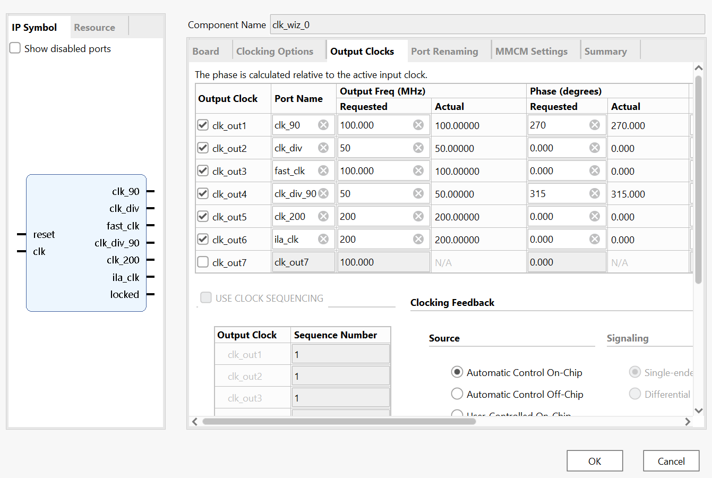

# A Simple DDR3 Memory Interface for Xilinx 7-Series FPGAs
 
A small, simple DDR3 SDRAM memory controller for Xilinx 7-series FPGAs, running at a
100 MHz memory clock. It was designed to be easy to understand and to use little FPGA
logic. Developed as a bachelor thesis at DTU Compute and tested on the Arty A7-100T board.
 
## Overview
 
The controller is split into three main modules:
 
- **Operation controller** — the top-level control module.
- **DDR controller** — a purely digital FSMD that issues the DDR3 commands.
- **PHY** — the physical layer.
Two test applications are included:
 
- A UART-based reliability test.
- A BRAM write-back test using UART.
## Features
 
- 100 MHz DDR3 memory clock
- Single-open-row policy
- Byte-addressed access with internal handling of unaligned and masked writes
- Runtime read calibration of the DQ/DQS delay taps
- Simple custom user interface with a `memory_busy` handshake
- Low FPGA utilization (~595 LUTs / 720 FFs), roughly 7× smaller than the MIG controller
## Problems
 
- Low throughput, max around 82 MB/s
- Not tested with a real application
- No full simulation
- No command pipelining
## Repository contents
 
## Clocking
 
The design uses the Vivado Clocking Wizard to generate all clocks from a single MMCM.
The configuration is shown here:
 

 
 
## Signal naming
 
This controller has a few signals that differ in name from the report:
 
- `write_flag` → `DQS_flag`
- `read_flag` → `READ_IS_NOW`
- `col_adresse` → `rowadresse`
- `row_adresse` → `col_adresse`
Note that the row and column address names are swapped between the report and the code.
 

